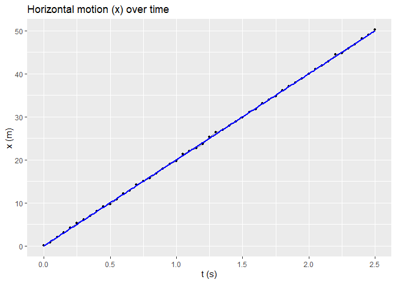
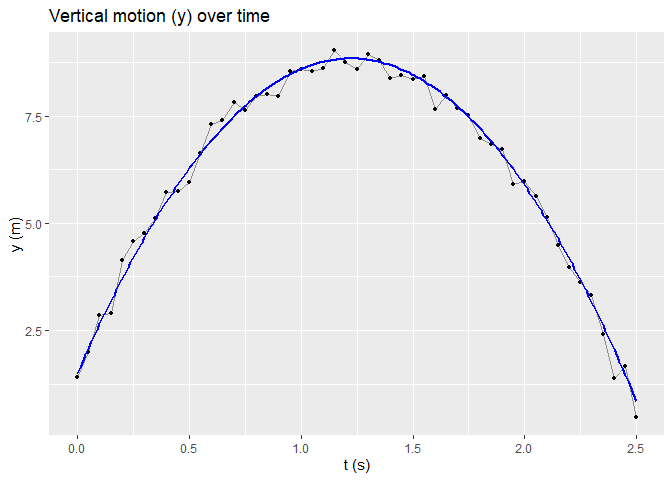

<!-- README.md is generated from README.Rmd. Please edit that file -->

# galileantools

<!-- badges: start -->
<!-- badges: end -->

The goal of galileantools is to provide tools for applying Galilean
transformations, simulating projectile motion from moving platforms,
estimating platform velocity, and visualizing results.

## Overview

`galileantools` provides utilities to: - apply Galilean
transformations, - simulate projectiles launched from a moving platform
(with measurement noise), - estimate platform velocity (and projectile
initial conditions), - visualize trajectories and diagnostics, - include
a tutorial vignette and an optional Shiny demo.

## Installation

You can install the development version of galileantools like so:

``` r
# FILL THIS IN! HOW CAN PEOPLE INSTALL YOUR DEV PACKAGE?
# after pushing to GitHub:
# install remotes if needed
# install.packages("remotes")
remotes::install_github("Ourbani237/galileantools")
# for local development:
# update documentation
devtools::document()
# install locally
devtools::install()
```

## Example

This is a basic example which shows you how to solve a common problem:

``` r
library(galileantools)
## basic example code

dat <- simulate_projectile(u0 = c(5,12), pos0 = c(0,1.5),
                           t = seq(0,2.5,0.05), v_platform = 15)

est <- estimate_platform_velocity(dat, known_u_x = 5)
print(paste("Estimated v:", round(est$v_est, 2)))
#> [1] "Estimated v: 14.99"

plots <- plot_trajectories(dat, model_par = c(u_x=5, u_y=12, v=15, h=1.5))
#> Warning: Using `size` aesthetic for lines was deprecated in ggplot2 3.4.0.
#> ℹ Please use `linewidth` instead.
#> ℹ The deprecated feature was likely used in the galileantools package.
#>   Please report the issue at
#>   <https://github.com/Ourbani237/galileantools/issues>.
#> This warning is displayed once every 8 hours.
#> Call `lifecycle::last_lifecycle_warnings()` to see where this warning was
#> generated.
plots$plot_x
```



``` r
plots$plot_y
```



## References / Help

For full documentation of functions, see the vignette:

vignette(“tutorial”, package = “galileantools”)

In that case, don’t forget to commit and push the resulting figure
files, so they display on GitHub and CRAN.
